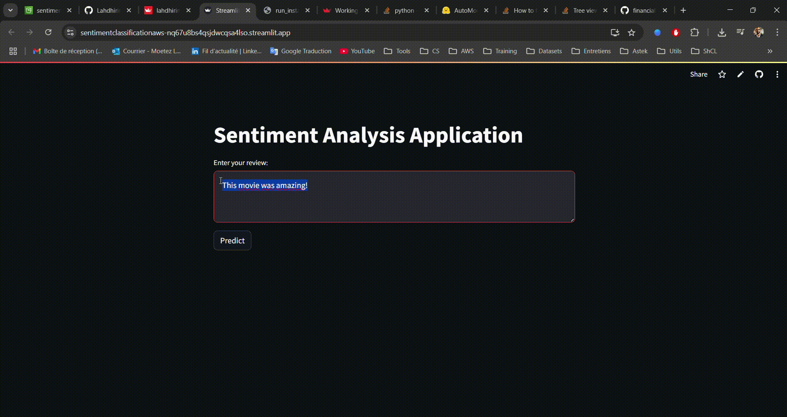

# Sentiment Classifier Applicaton using **Hugging Face Transformers** and **AWS Services (S3, EC2)** (Under Construction)
✅​ Preprocessing Pipeline : load, clean and split data

✅​ Training Pipeline : Train **TinyBERT** model

✅​​ Testing Pipeline : Evaluate the trained model and push model to **S3** bucket using **Boto3** (if the model meets the specified accuracy threshold)

✅​ (BONUS)​ Deploy the model on **Streamlit Share Server** (Public link: https://sentimentclassificationaws-nq67u8bs4qsjdwcqsa4lso.streamlit.app/)



✅ Deploy the model on **AWS EC2** instance and make prediction using **Streamlit** interface

## Steps to reduce overfitting
- Freeze the backbone of the model during training. Note that keeping the last encoder layer (bert.encoder.layer.3) trainable allows for greater task-specific adaptation; otherwise, the classifier alone is too simple to capture complex patterns (Accuracy 66%). 
- Add dropout layer control in the configuration.
- Disable learning rate warmup, otherwise the learning rate can remind too low and results in a fast overfiting.

## Output Examples
- Review: I recently watched this movie and was absolutely blown away by the performances. The story was heartwarming and the characters were incredibly well-developed. It kept me engaged from beginning to end, and I couldn’t stop smiling by the time it was over. Definitely one of the best films I’ve seen this year! ⇒ Prediction: positive (98.64%)
- Review: I contacted customer support for help with my account, but the experience was terrible. The representative was rude, unhelpful, and clearly not interested in resolving my issue. After waiting on hold for nearly an hour, I was told to check the FAQ instead. I left feeling frustrated and ignored ⇒ Prediction: negative (98.61%)

## AWS Services Configuration
1. Create a User using **AWS IAM Service** with the following permissions:
    - `AmazonEC2FullAccess`
    - `AmazonS3FullAccess`

    *(You can also create a custom policy for more restricted access if needed.)*

2. **Generate an Access Key** for this IAM user and **save the following securely**:
    - Access Key ID
    - Secret Access Key

3. The S3 Bucket will be created dynamically during the execution of the [testing_pipeline.py](src/testing_pipeline.py). If the best found model during training achieves the required score in the [testing_config.json](config/testing_config.json), it will be uploaded to this bucket.\
⚠️ (*Make sure the bucket name you configure is globally unique to avoid conflicts.*)

4. Create an EC2 instance with the following specifications:
    - **AMI**: Deep Learning OSS Nvidia Driver AMI GPU PyTorch 2.7 (Ubuntu 22.04)
    - **Instance type**: `t3.medium` (`t2.micro` could result in a timeout during the execution of the Streamlit application [app.py](src/web_app/app.py))
    - **Key Pair**: Use the key pair you download to connect via SSH
    - **Security Group**:
        - Allow inbound rules for ports: `22`, `80`, `8501`, `8502` (all TCP)
    - **Storage**: 120 GiB (gp3)

5. Run the EC2 instance and interact with it via SSH or any other remote access method to set up the environment:
    - Create a working directory:
        ```bash
        mkdir mlops
        cd mlops
        ```
    - Clone your GitHub repo:
        ```bash
        git clone https://github.com/Lahdhirim/NLP_sentiment_classification_aws.git
        cd NLP_sentiment_classification_aws
        ```
    - Install dependencies:
        ```bash
        pip install -r requirements.txt
        ```
    - Configure the AWS credentials using AWS CLI:
        ```bash
        aws configure Press ENTER
        AWS Access Key ID: ************
        AWS Secret Access Key: ************
        Default region name: Press ENTER
        Default output format: Press ENTER
        ```
    - Add Streamlit to PATH (for command-line use):
        ```bash
        echo 'export PATH="$HOME/.local/bin:$PATH"' >> ~/.bashrc
        source ~/.bashrc
        ```

6. (Optional but recommended) Run the Streamlit application from the terminal to ensure that everything is working correctly:
    ```bash
    streamlit run src/web_app/app.py
    ```

7. Automatically launch Streamlit on instance reboot:
    - Create the startup script:
      ```bash
      nano /home/ubuntu/start_streamlit.sh
      ```

      Paste the following:
      ```bash
      #!/bin/bash
      cd /home/ubuntu/mlops/NLP_sentiment_classification_aws
      source /home/ubuntu/.bashrc
      /home/ubuntu/.local/bin/streamlit run src/web_app/app.py >> /home/ubuntu/streamlit.log 2>&1
      ```

    - Make the script executable:
        ```bash
        chmod +x /home/ubuntu/start_streamlit.sh 
        ```
    - Add the script to `crontab` for reboot:
        ```bash
        crontab -e
        ```
        Add the following line at the end of file:
        ```bash
        @reboot /home/ubuntu/start_streamlit.sh
        ```

Each time the instance is rebooted, Streamlit will automatically launch the web application at the address  `http://<public IPv4 address>:8501`. A log file named  `streamlit.log` will be created in the  `/home/ubuntu` directory. This file can be used to monitor the application’s status and debug any errors.\
The application will be publicly accessible to anyone with the instance’s public IP address. Access can be controlled via the EC2 Security Group:
- To allow access from any IP address, set the Source  `to 0.0.0.0/0` on TCP port  `8501`.\
    ⚠️ Use  `0.0.0.0/0` only if you're aware of the security implications. For more restricted access, specify your own IP or a limited range.


